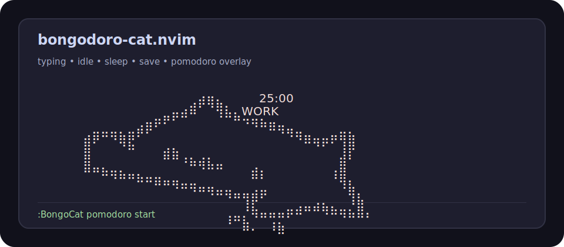

# bongodoro-cat.nvim

[](https://github.com/juanssanchezv/bongodoro-cat.nvim/actions/workflows/ci.yml)
[](https://github.com/juanssanchezv/bongodoro-cat.nvim/releases)
[](./LICENSE)

Neovim Bongo Cat plugin with a Unicode sprite, a floating window renderer, and a small animation engine for typing, idle, sleep, save, error, and Pomodoro timer reactions.



## Features

- Alternates left/right frames while typing.
- Runs a randomized idle animation after 5-15 seconds without input.
- Enters sleep after 45 seconds without input.
- Shows a save reaction after `:write`.
- Can show an error reaction when diagnostics report errors.
- Shows an optional Pomodoro timer overlay while the cat keeps animating normally.
- Renders in a configurable floating window.

## Installation

Using [lazy.nvim](https://github.com/folke/lazy.nvim):

```lua
{
  "juanssanchezv/bongodoro-cat.nvim",
  opts = {
    auto_start = true,
  },
}
```

For local development:

```lua
{
  dir = "/path/to/bongodoro-cat.nvim",
  opts = {
    auto_start = true,
  },
}
```

## Configuration

```lua
require("bongo_cat").setup({
  auto_start = true,
  window = {
    position = "bottom-right",
    border = "rounded",
    margin_x = 1,
    margin_y = 1,
  },
  animation = {
    idle_delay_min = 5000,
    idle_delay_max = 15000,
    idle_min_cycles = 2,
    idle_max_cycles = 8,
    idle_frame_tick = 120,
    sleep_timeout = 45000,
    sleep_tick = 700,
    event_tick = 700,
  },
  events = {
    save = true,
    error = false,
  },
  pomodoro = {
    enabled = true,
    work_minutes = 25,
    short_break_minutes = 5,
    long_break_minutes = 15,
    sessions_until_long_break = 4,
    auto_start_breaks = false,
    auto_start_work = false,
    show_timer = true,
  },
  keymaps = {
    toggle = "<leader>bc",
    pomodoro_start = nil,
    pomodoro_pause_resume = nil,
    pomodoro_stop = nil,
    pomodoro_status = nil,
  },
})
```

Pomodoro keymaps are disabled by default. Enable only the bindings you want:

```lua
require("bongo_cat").setup({
  keymaps = {
    pomodoro_start = "<leader>ps",
    pomodoro_pause_resume = "<leader>pp",
    pomodoro_stop = "<leader>px",
    pomodoro_status = "<leader>pi",
  },
})
```

## Commands

- `:BongoCat` toggles the cat.
- `:BongoCat toggle` toggles the cat.
- `:BongoCat show` shows the cat.
- `:BongoCat hide` hides the cat.
- `:BongoCat status` prints setup/visibility status.
- `:BongoCat pomodoro start` starts a work timer.
- `:BongoCat pomodoro pause` pauses the active timer.
- `:BongoCat pomodoro pause_resume` toggles pause/resume.
- `:BongoCat pomodoro resume` resumes a paused timer.
- `:BongoCat pomodoro stop` stops the active timer.
- `:BongoCat pomodoro status` prints Pomodoro status.

## Pomodoro

Pomodoro runs as an overlay on top of the current cat animation. The cat keeps typing, idling, sleeping, and reacting to save/error normally while the timer is active.

By default breaks do not start automatically. When a work session completes, Bongodoro Cat shows a notification and waits for the next command.

## Visual test

Launch Neovim with the local dev init to test the plugin in a real UI:

```sh
nvim -u ./scripts/minimal_init.lua
```

Suggested checks:

- enter Insert mode and type to verify `left` / `right` alternation
- stop typing and wait 5-15 seconds to verify the randomized idle animation
- wait 45 seconds without typing to verify `sleep`
- write a buffer with `:write` to verify the `save` reaction
- run `:lua require("bongo_cat.animator").on_event("error")` to verify the manual `error` reaction
- run `:BongoCat pomodoro start` to verify the Pomodoro overlay
- use `<leader>bt` to toggle the cat during testing

## Smoke Test

Run the headless smoke test before publishing or after changing frames:

```sh
nvim --headless -u NONE -l ./scripts/smoke_test.lua
```

Expected output:

```text
bongodoro-cat.nvim smoke ok: frames=36x12
```

## CI

The GitHub Actions workflow runs the smoke test and health check on pushes and pull requests to `main`.

## Health Check

Run Neovim's built-in health check:

```vim
:checkhealth bongo_cat
```

## Roadmap

- Pomodoro-specific visual polish for work and break states.
